# CIBELApps (CIBer-angEL Apps): Aplicación para la gestión de la seguridad personal asociada al uso de aplicaciones móviles

## Descripción
En un mundo cada vez más digitalizado, la seguridad de las aplicaciones móviles se ha vuelto una preocupación crucial. En respuesta a esta creciente necesidad, se presenta la aplicación CIBELApps (CIBer-angEL Apps), diseñada para proporcionar a los usuarios una herramienta integral para gestionar y mejorar la seguridad de sus aplicaciones móviles.

## Funcionalidades
La aplicación se divide en dos pestañas principales: Home y Perfil.

### Pestaña Home
En la pestaña Home, los usuarios tienen acceso a un catálogo de aplicaciones organizadas por categorías, permitiéndoles explorar información detallada sobre cada una. A simple vista, pueden visualizar el icono, el nombre y la puntuación de seguridad de las aplicaciones.

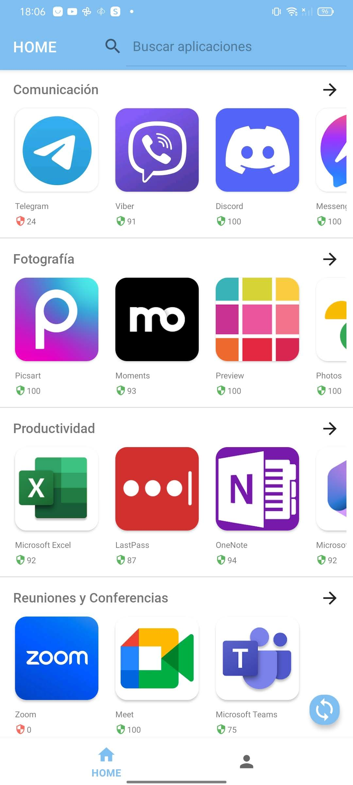

Al seleccionar una categoría, el usuario puede explorar una lista vertical más cómoda de aplicaciones en dicha categoría, con la posibilidad de ordenarla según su puntuación de seguridad, ya sea de forma ascendente o descendente.   

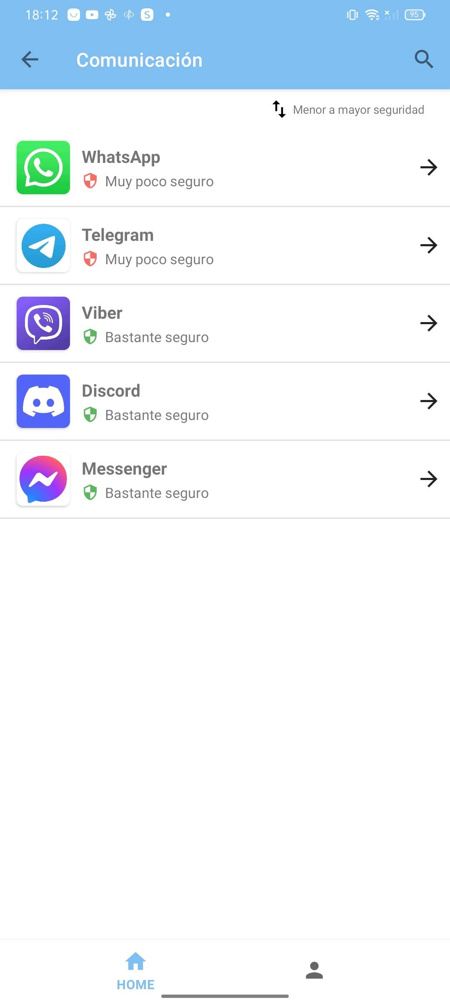 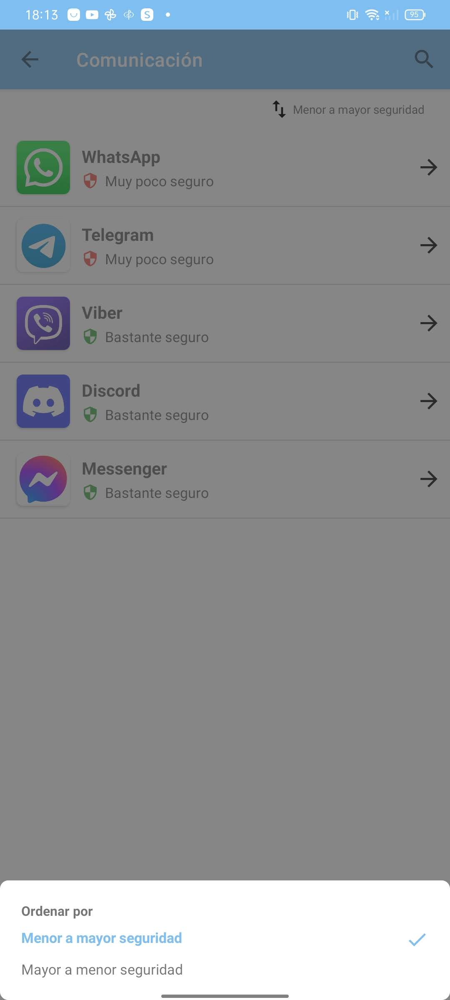

Asimismo, la aplicación ofrece un buscador que permite buscar aplicaciones por nombre o categoría, y los resultados pueden ordenarse igualmente por puntuación de seguridad.

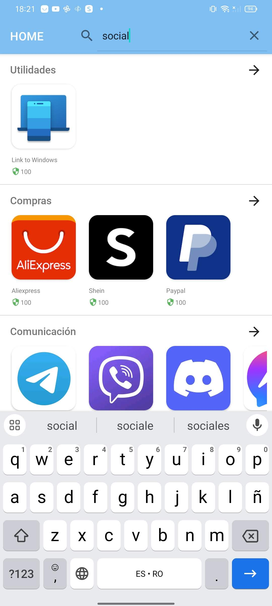 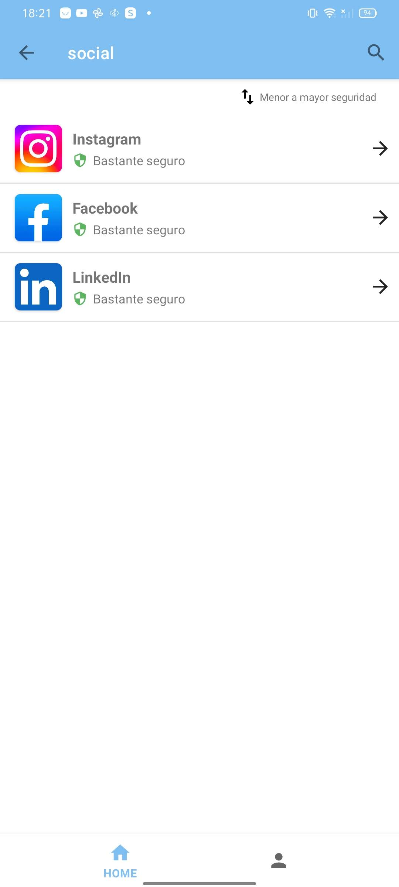

### Detalle de Aplicación
Al seleccionar cualquier aplicación, se despliega información detallada, incluyendo nombre, categoría, icono, puntuación de seguridad y un gráfico que clasifica sus fallos de seguridad por gravedad. También se presenta una lista de fallos de seguridad, con resumen sobre su impacto en confidencialidad, integridad y disponibilidad, permitiendo ordenarla por antigüedad o gravedad, de manera ascendente o descendente. Además, desde esta vista los usuarios pueden agregar o eliminar aplicaciones del perfil según las tengan instaladas o no en su dispositivo móvil. Al añadir una aplicación, un icono indicativo aparece en el catálogo para señalar su inclusión. 

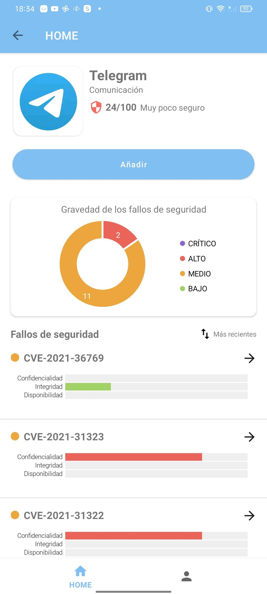 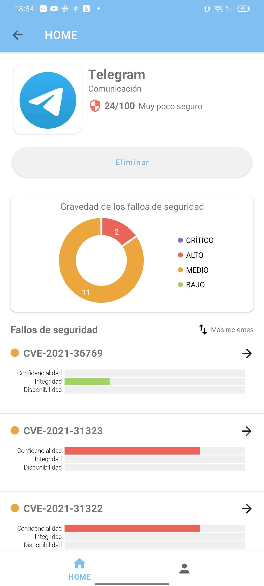 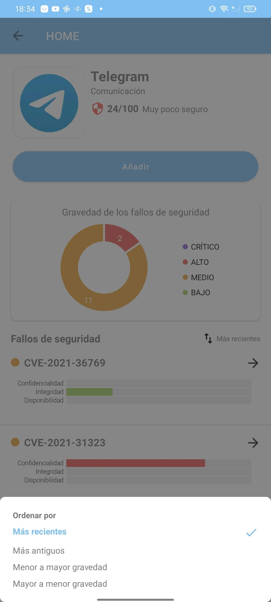 

### Detalle de fallo de seguridad
Al seleccionar un fallo de seguridad o CVE (Common Vulnerabilities and Exposures), se presenta información detallada, incluyendo el identificador del CVE, descripción, gravedad e impacto en confidencialidad, integridad y disponibilidad. Para aquellos usuarios no familiarizados con estos conceptos, se proporciona un icono informativo.

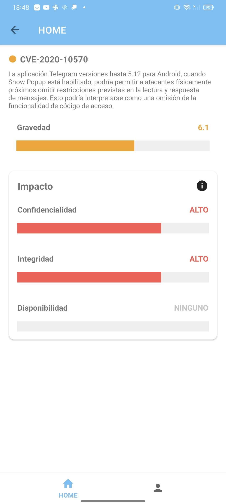 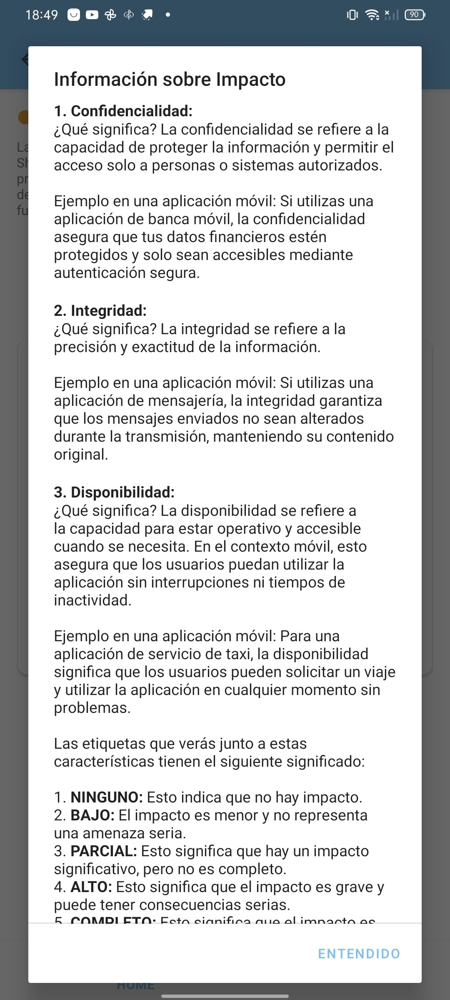

### Pestaña Perfil
En la pestaña de Perfil, se exhibe un gráfico que refleja la puntuación de seguridad global del usuario, basada en las aplicaciones agregadas al perfil. La lista de aplicaciones incluidas se presenta para un control más detallado, permitiendo ordenarla por seguridad, ya sea de forma ascendente o descendente.

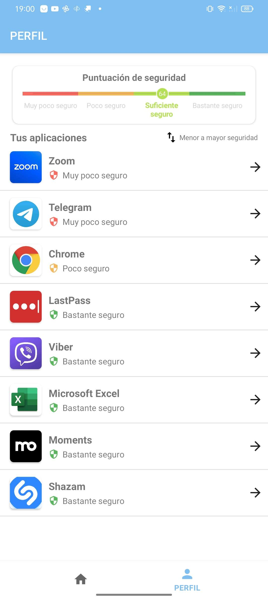

### Sincronizar aplicaciones
Por último, la aplicación ofrece la opción de agregar automáticamente al perfil las aplicaciones instaladas en el dispositivo del usuario. Al seleccionar el icono de sincronización en la esquina inferior derecha de la pestaña Home, se informa al usuario sobre esta funcionalidad. Si decide utilizarla, se solicitan los permisos de lectura, y tras la lectura completa, se muestra otro mensaje indicando el número de aplicaciones leídas y aquellas sin datos disponibles. Las aplicaciones leídas se añaden al perfil, incluyendo la versión instalada por lo que se hace un filtrado de los fallos de seguridad eliminando aquellos que no afectan a la versión específica del usuario, actualizando así las notas de seguridad.

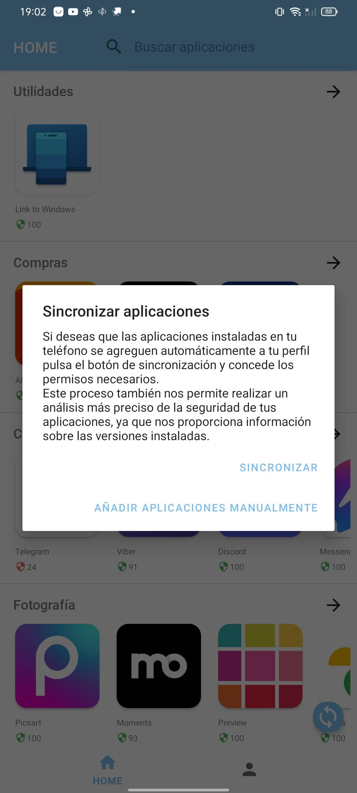 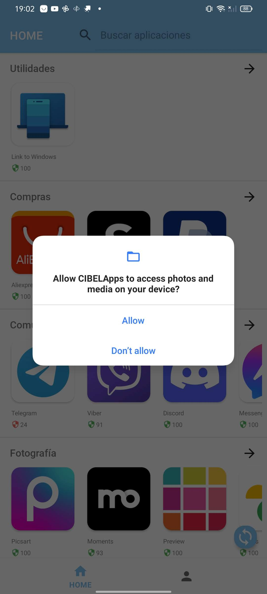 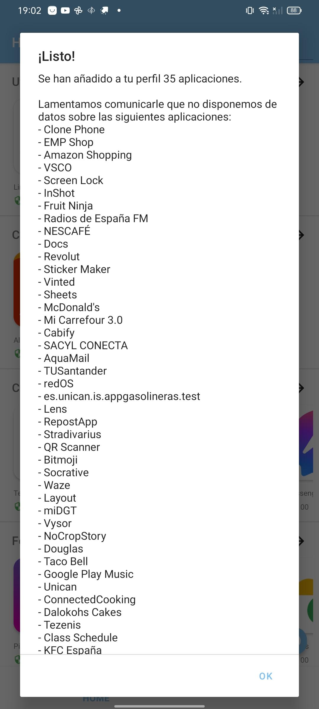 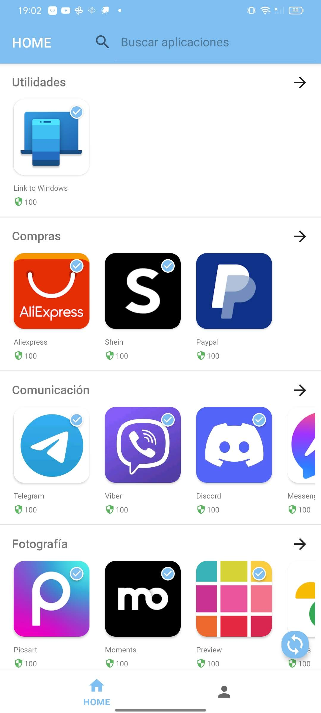
